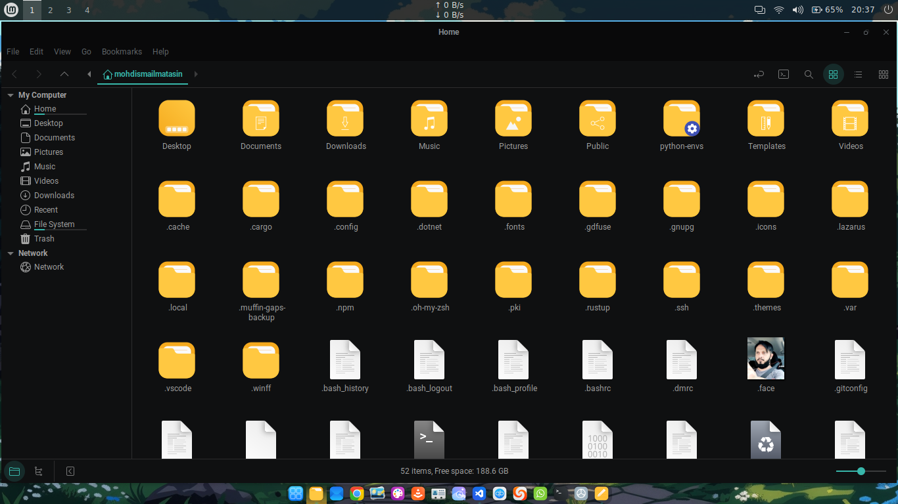
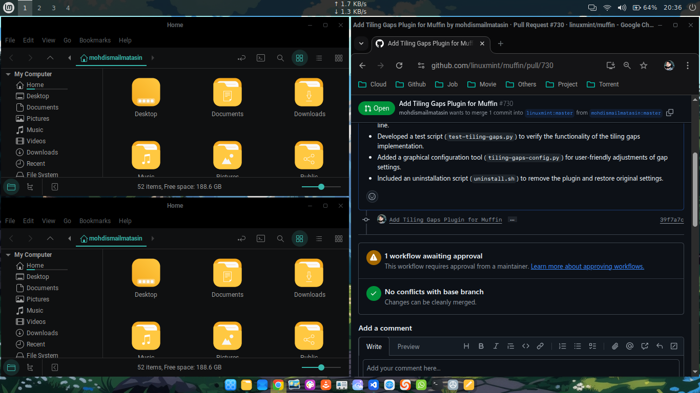
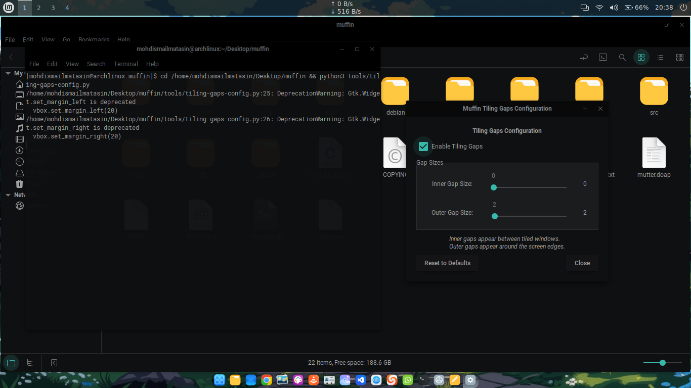
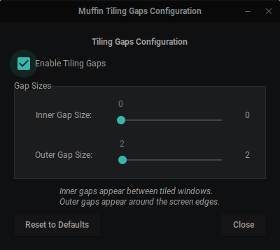

# Muffin Tiling Gaps Patch

A comprehensive patch for Muffin (Cinnamon's window manager) that adds configurable tiling gaps functionality with GUI and command-line configuration tools.

## 🎯 What This Patch Does

This patch extends Muffin with:

- **Configurable tiling gaps** between windows when tiled
- **Inner gaps** (between tiled windows)
- **Outer gaps** (between tiled windows and screen edges)
- **GUI configuration tool** with real-time sliders
- **Command-line interface** for scripting and automation
- **GSettings integration** for persistent settings
- **Automatic backup/restore** of original Muffin library

## 🚀 Features

- ✅ **Smart Gap Management**: Gaps only apply to tiled windows, not maximized ones
- ✅ **Real-time Configuration**: Adjust gaps with live preview using GUI sliders
- ✅ **Command Line Control**: Script-friendly CLI for automation
- ✅ **Persistent Settings**: Configuration survives reboots and Cinnamon restarts
- ✅ **Safe Installation**: Automatic backup of original Muffin library
- ✅ **Easy Uninstall**: Complete restoration to original state
- ✅ **Preserved Scripts**: Installation/uninstall scripts remain for future use

## 📋 Prerequisites

### Required Dependencies

```bash
# Arch Linux / Manjaro
sudo pacman -S base-devel meson ninja git python python-gobject gtk3

# Ubuntu / Debian
sudo apt install build-essential meson ninja-build git python3 python3-gi gir1.2-gtk-3.0

# Fedora
sudo dnf install @development-tools meson ninja-build git python3 python3-gobject gtk3-devel
```

### System Requirements

- **Cinnamon Desktop Environment** (tested on Cinnamon 6.x)
- **Muffin 6.4.1** (or compatible version)
- **Linux distribution** with development tools
- **Root access** for system library installation

## 🔧 Installation

### 1. Download and Prepare

```bash
# Clone or download the patched Muffin source
cd ~/Desktop
# (Assuming you have the muffin directory with patches applied)
cd muffin
```

### 2. Run Installation

```bash
# Make installation script executable
chmod +x install.sh

# Run the installer
./install.sh
```

### 3. Installation Process

The installer will:

1. ✅ Check all required dependencies
2. ✅ Create backup of original Muffin library
3. ✅ Build Muffin with tiling gaps support
4. ✅ Install the new library system-wide
5. ✅ Set up GSettings schema
6. ✅ Create configuration tools
7. ✅ Restart Cinnamon automatically
8. ✅ Test the installation

### 4. Post-Installation

After installation completes, you'll have:

- **GUI Tool**: `tools/tiling-gaps-config.py`
- **CLI Tool**: `tools/muffin-gaps`
- **Test Script**: `tools/test-tiling-gaps.py`
- **Backup**: `~/.muffin-gaps-backup/`

## 🎮 Usage

### GUI Configuration

```bash
# Launch the graphical configuration tool
python3 tools/tiling-gaps-config.py
```

**GUI Features:**

- 🎚️ **Real-time sliders** for inner and outer gaps
- 🔘 **Enable/disable toggle** for tiling gaps
- 👁️ **Live preview** of changes
- 💾 **Automatic saving** of settings

### Command Line Interface

```bash
# Enable tiling gaps
./tools/muffin-gaps enable

# Disable tiling gaps
./tools/muffin-gaps disable

# Set inner gap size (between windows)
./tools/muffin-gaps set-inner 15

# Set outer gap size (screen edges)
./tools/muffin-gaps set-outer 20

# Check current status
./tools/muffin-gaps status

# Show help
./tools/muffin-gaps help
```

### Testing Tiling Gaps

```bash
# Run the test script
python3 tools/test-tiling-gaps.py
```

**Manual Testing:**

1. Enable gaps: `./tools/muffin-gaps enable`
2. Set gap sizes: `./tools/muffin-gaps set-outer 20`
3. **Drag windows to screen edges** to tile them
4. **Observe gaps** between tiled windows
5. **Double-click title bars** to maximize (gaps disappear)

## 🗑️ Uninstallation

### Complete Removal

```bash
# Run the uninstaller
./uninstall.sh
```

### Uninstallation Process

The uninstaller will:

1. ✅ Restore original Muffin library from backup
2. ✅ Remove configuration tools
3. ✅ Reset GSettings to defaults
4. ✅ Clean build artifacts
5. ✅ Restart Cinnamon
6. ✅ Preserve install/uninstall scripts for future use

### Manual Cleanup (if needed)

```bash
# Remove backup (optional)
rm -rf ~/.muffin-gaps-backup

# Remove tools directory (optional)
rm -rf tools/
```

## ⚙️ Configuration Details

### GSettings Schema

Settings are stored in: `org.cinnamon.muffin.tiling-gaps`

**Available Keys:**

- `gaps-enabled` (boolean): Enable/disable tiling gaps
- `inner-gap-size` (integer): Gap size between tiled windows
- `outer-gap-size` (integer): Gap size from screen edges

### Default Values

- **Gaps Enabled**: `false`
- **Inner Gap Size**: `10` pixels
- **Outer Gap Size**: `10` pixels

### Manual GSettings Commands

```bash
# Enable gaps
gsettings set org.cinnamon.muffin.tiling-gaps gaps-enabled true

# Set inner gaps
gsettings set org.cinnamon.muffin.tiling-gaps inner-gap-size 15

# Set outer gaps
gsettings set org.cinnamon.muffin.tiling-gaps outer-gap-size 20

# Check current settings
gsettings list-recursively org.cinnamon.muffin.tiling-gaps
```

## 🔍 Troubleshooting

### Common Issues

**1. Build Failures**

```bash
# Check dependencies
./install.sh  # Will report missing dependencies

# Clean and retry
rm -rf build/
./install.sh
```

**2. Cinnamon Won't Start**

```bash
# Restore from backup
sudo cp ~/.muffin-gaps-backup/libmuffin.so.0.0.0 /usr/lib/
sudo ldconfig
```

**3. Settings Not Persisting**

```bash
# Recompile GSettings schemas
sudo glib-compile-schemas /usr/local/share/glib-2.0/schemas/
```

**4. Tools Not Working**

```bash
# Check if tools exist
ls -la tools/

# Recreate tools (if missing)
./install.sh  # Will recreate missing tools
```

### Getting Help

- Check installation logs for error messages
- Verify all dependencies are installed
- Ensure Cinnamon is running before installation
- Use the backup to restore if needed

## 📁 File Structure

```
muffin/
├── install.sh              # Installation script (preserved)
├── uninstall.sh            # Uninstallation script (preserved)
├── tools/                  # Configuration tools (created during install)
│   ├── muffin-gaps         # Command-line interface
│   ├── tiling-gaps-config.py # GUI configuration tool
│   └── test-tiling-gaps.py # Testing script
├── src/                    # Patched Muffin source code
├── data/                   # GSettings schema files
└── build/                  # Build artifacts (temporary)
```

## 🎯 Key Benefits

- **🔄 Reusable**: Scripts preserved for future installations
- **🛡️ Safe**: Automatic backup and restore functionality
- **🎨 Flexible**: Both GUI and CLI configuration options
- **⚡ Fast**: Real-time configuration changes
- **🧹 Clean**: Complete uninstallation support
- **📱 Modern**: Integrated with Cinnamon's settings system

## 🔧 Technical Implementation

### Patch Components

- **Core Logic**: Modified window tiling functions in `src/core/window.c`
- **GSettings Schema**: Added `org.cinnamon.muffin.tiling-gaps.gschema.xml`
- **Configuration Tools**: Python-based GUI and shell-based CLI
- **Build System**: Enhanced meson build configuration

### How It Works

1. **Gap Calculation**: Gaps are calculated during window tiling operations
2. **Smart Detection**: Only applies to tiled windows, not maximized ones
3. **Real-time Updates**: Settings changes apply immediately without restart
4. **Memory Efficient**: Minimal overhead on window management

### Compatibility

- **Muffin Version**: 6.4.1 (adaptable to other versions)
- **Cinnamon**: 6.x series (backward compatible)
- **Architecture**: x86_64 (adaptable to other architectures)

## 📝 Notes

- **Backup Location**: `~/.muffin-gaps-backup/`
- **Scripts Preserved**: Installation and uninstallation scripts remain after use
- **Cinnamon Restart**: Required after installation/uninstallation
- **Root Access**: Needed for system library installation
- **Compatibility**: Tested with Muffin 6.4.1 and Cinnamon 6.x

## 🤝 Contributing

### Reporting Issues

- Provide system information (OS, Cinnamon version, Muffin version)
- Include installation logs and error messages
- Describe steps to reproduce the issue

### Development

- Fork the repository and create feature branches
- Test thoroughly on different Cinnamon versions
- Follow existing code style and documentation standards

---

## Example







**Enjoy your enhanced Cinnamon desktop with configurable tiling gaps!** 🎉
